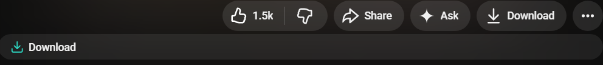

# NJK YouTube Downloader

> A lightweight Chromium extension that adds a native **Download** button directly to YouTube, allowing you to send videos to your own local download server.

Unlike traditional downloader extensions, **NJK YouTube Downloader** does not rely on third-party websites or cloud services. It simply communicates with a local server running on your own computer, giving you full control over the downloading process.

---

## Features

### 🎬 Native YouTube Integration
- Adds a **Download** button beside YouTube's Like and Share buttons.
- Matches YouTube's native interface.
- Works directly on watch pages.

### ⚡ Local Download Server
- Sends the current video's URL to your own local downloader.
- No remote servers involved.
- Faster and more reliable than web-based download services.

### 🔒 Privacy First
- No analytics
- No tracking
- No user accounts
- No advertisements
- Video URLs are sent only to your local machine.

### 💻 Lightweight
- Minimal permissions
- No background scripts
- Fast page loading
- Low memory usage

---

# How It Works

```
YouTube Page
      │
      ▼
Download Button
      │
      ▼
Chrome Extension
      │
      ▼
http://localhost:9999
      │
      ▼
Your Local Downloader
      │
      ▼
Download Begins
```



The extension simply captures the current YouTube video's URL and forwards it to a locally running server.

The actual downloading process is handled entirely by your own application.

---

# Requirements

Before using this extension, ensure that your local download server is running.

By default, the extension communicates with:

```
http://localhost:9999
```

If no server is running, the Download button will not function.

---

# Installation

## Chrome / Brave / Edge

1. Download or clone this repository.

2. Extract the project.

3. Open:

```
chrome://extensions
```

or

```
brave://extensions
```

4. Enable **Developer Mode**.

5. Click **Load unpacked**.

6. Select the extension folder.

7. Open YouTube.

You should now see the **Download** button below supported videos.

---

# Project Structure

```
NJK-YT-Downloader/
│
├── manifest.json        Extension configuration
├── content.js           Injects the Download button
├── icons/               Extension icons
└── README.md
```

---

# Permissions

### activeTab

Allows the extension to interact with the currently open YouTube tab.

### storage

Used for storing extension settings (if applicable).

### Host Permissions

```
https://*.youtube.com/*
```

Required for injecting the Download button into YouTube.

```
http://localhost:9999/*
```

Required for communicating with your local download server.

No external servers are contacted.

---

# Browser Compatibility

✔ Google Chrome

✔ Brave Browser

✔ Microsoft Edge

✔ Opera

✔ Vivaldi

*(Any Chromium-based browser supporting Manifest V3.)*

---

# Privacy

NJK YouTube Downloader does **not**:

- collect personal information
- track browsing activity
- send data to external servers
- use analytics
- display advertisements

The extension communicates **only** with:

- YouTube (the page you're viewing)
- Your own local server (`localhost`)

---

# Security

The extension never downloads videos itself.

Its only responsibility is to:

1. Detect the current YouTube video.
2. Send the video URL to your local downloader.
3. Let your own application handle the download.

This architecture keeps the extension lightweight and gives you full control over the download process.

---

# Roadmap

Planned improvements:

- Download progress indicator
- Download quality selection
- Audio-only downloads
- Playlist support
- Batch downloads
- Download history
- Custom local server address
- Dark/light theme compatibility
- Keyboard shortcuts

---

# Development

Built using:

- JavaScript
- Chrome Extension Manifest V3
- Content Scripts
- Fetch API

No external libraries or frameworks are required.

---

# Disclaimer

This project is intended for personal use and educational purposes.

Users are responsible for ensuring that any downloaded content complies with YouTube's Terms of Service and applicable copyright laws in their jurisdiction.

---

# License

MIT License

---

# Author

**Niranjan**

Designed and developed to provide a simple, private, and locally controlled YouTube download workflow.