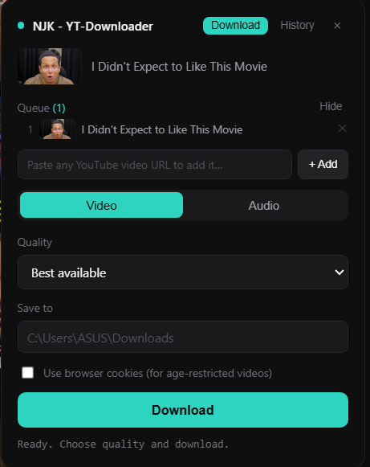

<div align="center">


<a href="https://readme-typing-svg.demolab.com">
  
</a>

<br/><br/>

<p>
  
  
  
</p>

<p>
  
  
  
</p>

<p align="center">
  <a href="#-how-it-works"><b>How It Works</b></a> &nbsp;•&nbsp;
  <a href="#-installation"><b>Install</b></a> &nbsp;•&nbsp;
  <a href="#-privacy--security"><b>Privacy</b></a> &nbsp;•&nbsp;
  <a href="#-roadmap"><b>Roadmap</b></a>
</p>

</div>

<br/>

> A lightweight Chromium extension that drops a native **Download** button right beside YouTube's Like and Share buttons — no third-party sites, no cloud services, no accounts. It just hands the video URL to a local server running on *your* machine, and your own app does the rest.

<br/>


<br/>

## 🔴 Why "Local Only" Matters

<div align="center">

<table>
<tr>
<td align="center" width="33%">

### 🚫
**No Cloud**
Nothing ever leaves your machine except the request to YouTube itself

</td>
<td align="center" width="33%">

### 🪶
**Featherweight**
No background scripts, minimal permissions, near-zero memory footprint

</td>
<td align="center" width="33%">

### 🔓
**Full Control**
Your downloader, your rules — the extension just points the way

</td>
</tr>
</table>

</div>

<br/>

## ⚙️ How It Works

<div align="center">

```
   ▶️  YouTube Page
        │
        ▼
   🔴  [ Download ]  ← injected next to Like / Share
        │
        ▼
   🧩  Chrome Extension  (content.js)
        │
        ▼
   📡  http://localhost:9999
        │
        ▼
   💻  Your Local Downloader
        │
        ▼
   ⬇️   Download Begins
```

</div>

The extension's entire job is capturing the current video's URL and forwarding it to your locally running server — **that's it**. All actual downloading is handled by your own application on the other end.

<br/>

## 🖼️ Screenshots

<table>
  <tr>
    <td width="50%"><p align="center"><sub>Download button on YouTube</sub></p></td>
    <td width="50%"><p align="center"><sub>Extension in action</sub></p></td>
  </tr>
</table>

<br/>

## 🧾 Requirements

<div align="center">

> ⚠️ **Your local download server must be running before the button will work.**
>
> By default, the extension talks to:
> ```
> http://localhost:9999
> ```
> No server running → the Download button simply won't do anything.

</div>

<br/>

## 📥 Installation

<div align="center">


</div>

<br/>

1. Download or clone this repository, then extract if downloaded as a ZIP
2. Install the Python dependencies from the project folder:
  ```powershell
  py -m pip install -r requirements.txt
  ```
3. Open `app.pyw` to start the local server and tray app. The app automatically downloads `yt-dlp` and FFmpeg into `bin/` when they are needed.
4. Open `chrome://extensions` (or `brave://extensions`, `edge://extensions`)
5. Enable **Developer Mode**
6. Click **Load unpacked**
7. Select the `extension` folder
8. Open YouTube — the **Download** button appears below supported videos 🎉

<br/>

## 📁 Project Structure

```
NJK-YT-Downloader/
├── manifest.json     # Extension configuration
├── content.js          # Injects the Download button
├── icons/                # Extension icons
└── README.md
```

<br/>

## 🔑 Permissions

<div align="center">

| Permission | Why |
|---|---|
| `activeTab` | Interact with the currently open YouTube tab |
| `storage` | Store extension settings, if applicable |
| Host: `https://*.youtube.com/*` | Inject the Download button into YouTube |
| Host: `http://localhost:9999/*` | Talk to your local download server |

**No other hosts are ever contacted.**

</div>

<br/>

## 🌐 Browser Compatibility

<div align="center">

✔️ Google Chrome &nbsp;·&nbsp; ✔️ Brave &nbsp;·&nbsp; ✔️ Microsoft Edge &nbsp;·&nbsp; ✔️ Opera &nbsp;·&nbsp; ✔️ Vivaldi

*Any Chromium-based browser that supports Manifest V3.*

</div>

<br/>

## 🔒 Privacy & Security

<div align="center">


</div>

The extension talks to exactly two places: **the YouTube page you're on**, and **your own `localhost` server**. Nothing else. It never downloads anything itself — it detects the current video, sends the URL to your local downloader, and steps out of the way. Your own application handles everything from there.

<br/>

## 🗺️ Roadmap

- [ ] Download progress indicator
- [ ] Download quality selection
- [ ] Audio-only downloads
- [ ] Playlist support
- [ ] Batch downloads
- [ ] Download history
- [ ] Custom local server address
- [ ] Dark/light theme compatibility
- [ ] Keyboard shortcuts

<br/>

## 🛠️ Built With

<div align="center">


No external libraries or frameworks required.

</div>

<br/>

## ⚠️ Disclaimer

> This project is intended for **personal use and educational purposes**. You're responsible for ensuring any downloaded content complies with YouTube's Terms of Service and the copyright laws that apply in your jurisdiction.

<br/>

## 📄 License

<div align="center">


Free to use, modify, and distribute — just keep the copyright notice. 

</div>

<br/>

## 👤 Author

<div align="center">

**Niranjan**
<br/>
*Built for a simple, private, locally-controlled YouTube download workflow.*

<br/>


</div>
